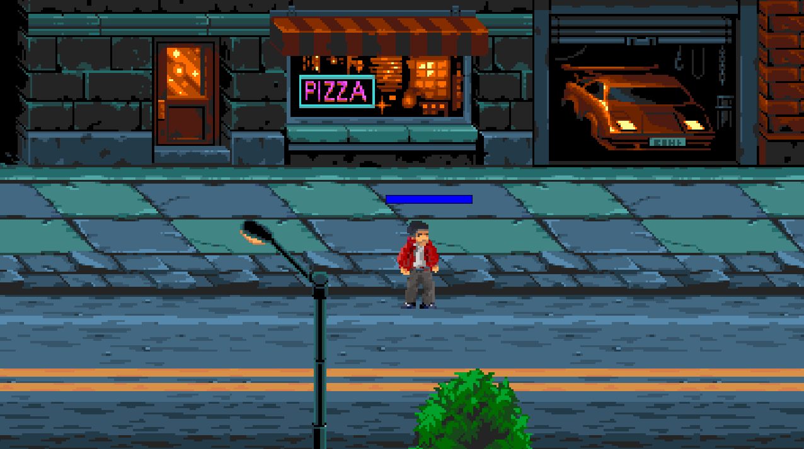
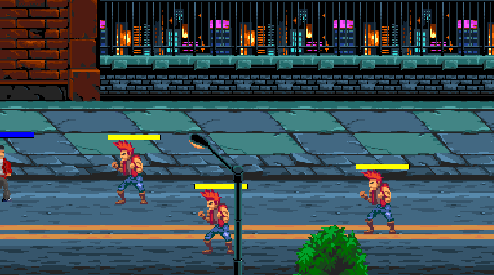

# Beer em Up

## Descrição

O Beer em up é um jogo do estilo beat 'em up, onde o jogador controla um personagem que deve derrotar inimigos para avançar de fase. O jogo possui um sistema de combate, no qual o player pode realizar golpes como chutes e socos para derrotas os inimigos.

O jogo foi desenvolvido para a disciplina de Design e Desenvolvimento de Jogos.

## Como jogar o jogo

1. Baixe o arquivo beer.exe

2. Execute o arquivo como administrador 

3. Siga os passos do instalador

4. Jogue! WASD para se movimentar, J para "Jab" e K para "Kick".


## Tecnologias

- Game Maker Engine

## Como rodar o projeto

1. Clone o repositório

```bash
git clone https://github.com/ArthurFeu/beer-em-up
```

2. Abra o diretorio

```bash
cd beer-em-up
```

3. Abra o projeto utilizando o Game Maker Studio 2

4. Execute o projeto

## Telas

### Tela do player parado

  

### Tela do player andando

  

### GamePlay


https://github.com/user-attachments/assets/5c1801dd-1057-4bb2-89cb-23a679fd5718


